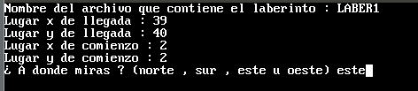
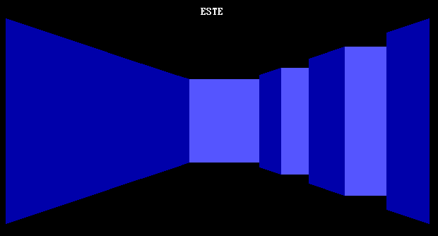
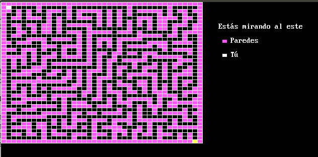

# Laberynth
This is the first approach to implement a fake 3D game. The goal is to exit the maze the player is. To run the program you may use http://www.qb64.net/.
After installing it, run the file LABERIN2.BAS. 
The game come with a predefined maze (the editor is part of another program I will upload later). To play with it, you have to enter the following data asked by the console:
- **LABER1** (Uppercase, important)
- **39**
- **40**
- **2**
- **2**
- **este**
You will see something like this:

If you entered everything correctly, then the initial screen will show up:

Arrow keys will allow the player to move forward, backward, turn right and turn left. 
F1 will make the game to finish, and F2 will show you a map of the maze for a few seconds.

Of course, if you find the exit you will win the game. Enjoy!!

